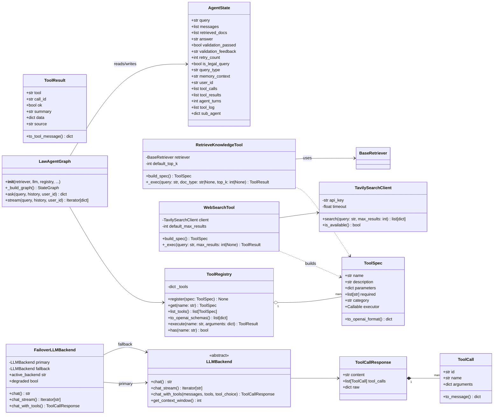
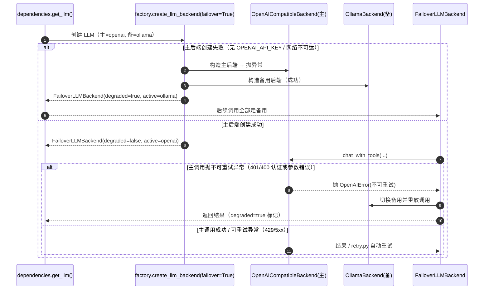
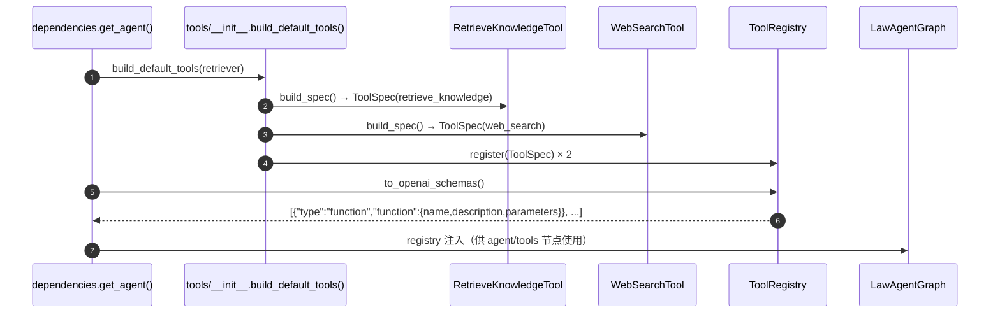

# Law-RAG-Agent M1 工具调用型 Agent 架构设计

| 项目 | 内容 |
| :--- | :--- |
| 文档版本 | v1.0（评审稿） |
| 编写日期 | 2026-08-12 |
| 作者 | 架构师（高见远） |
| 上游输入 | 《自主Agent重构PRD.md》v0.1（已确认） |
| 适用范围 | M1 工具调用型 Agent（F1-F5） |
| 原则 | 复用现有 src/llm、src/rag、src/agents、src/api 结构与风格，最小变更 |

---

## 1. PRD 技术可行性评审

### 1.1 总体结论

**M1 范围（F1-F5）技术可行，工程量集中在 F2（ReAct 循环）与 F5（后端切换）**。现有基础设施（LangGraph 1.2 手动 StateGraph、LLM 双后端工厂、pgvector 检索链、SSE 桥接）与 M1 目标高度匹配，无颠覆性改造需求。但有 **1 个必须修正的配置错误（模型名弃用）**、**2 个关键技术决策（bind_tools 用法、工具调用轮流式策略）** 需在实现前拍板，详见下文。

### 1.2 逐功能评审

#### F1 工具注册框架 —— ✅ 可行，低风险

- 现状：检索链完整（pgvector → Reranker → AdjacentExpander → Hybrid(BM25) → ArticleRouter），`retriever.search(query, top_k, doc_type)` 是统一的检索入口，非常适合封装为 `retrieve_knowledge` 工具，无需改动检索层。
- 建议：工具层新增独立包 `src/agents/tools/`，提供 `ToolSpec`（name/description/JSON-Schema/executor）+ `ToolRegistry`（注册/列出 schema/执行）。schema 用 OpenAI 兼容的 JSON Schema 格式，与 DeepSeek/Ollama 的 `tools` 参数直接对齐，避免二次转换。
- 风险：低。不触碰现有检索链路，纯增量。

#### F2 ReAct 循环 —— ⚠️ 可行，但 bind_tools 用法必须澄清

- PRD 写"LLM bind_tools → 工具节点 → 循环边"。**bind_tools 是 LangChain ChatModel 的 API，不是 LangGraph 的 API**。LangGraph 1.2 提供两条路线：
  - **路线 A（prebuilt）**：`langgraph.prebuilt.create_react_agent(model, tools)`，要求 model 是 LangChain `BaseChatModel`、tools 是 LangChain `Tool` 对象。
  - **路线 B（手动 StateGraph）**：在现有 `StateGraph` 上增加 `agent` 节点 + `tools` 节点 + 条件边，LLM 调用由自研 `LLMBackend` 完成。
- **本项目现状**：OpenAI 后端是自研 `OpenAICompatibleBackend`（直接调 openai SDK），**没有** LangChain ChatModel 包装；Ollama 虽有 `OllamaLangChainWrapper` 但生产路径未使用（graph 走 `LLMAdapter`）。若走路线 A，需要：给 OpenAI 后端新写 BaseChatModel 包装 + 把内部工具包成 LangChain Tool + 接入 ToolNode/ToolMessage —— 改动面大，且 langchain 1.3 与 langgraph 1.2 的 tool-calling 兼容性需额外验证。
- **决策（D1）：采用路线 B**，在自研 `LLMBackend` 上新增 `chat_with_tools()`，LangGraph 层手写 ReAct 循环。理由：① 符合现有"自研抽象直接调 SDK"的代码风格；② 对 tool_calls 响应结构与错误处理完全可控；③ 不引入新的 langchain 兼容层，回归风险最小；④ 未来 M3 多 Agent 升级时，节点级扩展位更清晰。
- 循环结构：`agent(LLM+tools) → tools(执行全部 tool_calls) → agent …（≤N 轮）→ 产出答案 → validate → END`。轮数上限 `AGENT_MAX_TOOL_TURNS=5`（REQ-UW4）。
- 注意：DeepSeek V4 的 `parallel_tool_calls` **总是启用**（一次可返回多个 tool_calls），`tools` 节点必须遍历执行**所有** tool_calls 并逐一回填结果，不能只执行第一个。

#### F3 web_search 工具 —— ✅ 可行，低风险

- Tavily 官方 SDK `tavily-python`（当前 0.7.x）用法：`TavilyClient(api_key=...).search(query, max_results=5)`，返回 `{results: [{title, url, content, score}], ...}`，与 LangChain/LangGraph 生态同源，集成成本极低。
- 建议：新增 `src/search/tavily.py` 做轻量封装（超时、Key 缺失检测、异常归一化），工具层只依赖封装后的接口，便于将来替换搜索供应商。
- 失败处理（REQ-UW1）：Tavily 失败/超时 → 工具返回 `ok=False` + `error="搜索不可用"` 的 ToolResult，不抛出中断循环；LLM 看到"搜索不可用"标记后仅基于内部库回答，前端透传该标记。

#### F4 SSE 过程透传 —— ✅ 可行，低风险

- 现状：`routes.py` 的 `_bridge_sync_stream` 已实现"同步生成器 → 异步 SSE"通用桥接，任何 `{"type": ..., "content": ...}` dict 事件都会被透传；现有事件类型 thinking/token/meta/FAQ/clear/error 由 `agent.stream()` 自行产出。
- 建议：M1 在 `agent.stream()` 中新增两类事件，**前端按新事件渲染，旧事件完全不变（向后兼容 AC-7）**：
  - `{"type": "tool_call", "tool": "retrieve_knowledge", "arguments": {...}}`（LLM 决策调用工具时推送）
  - `{"type": "tool_result", "tool": "retrieve_knowledge", "ok": true, "summary": "检索到 5 条相关法条"}`（工具执行完推送）
- 前端改动仅为新增事件处理分支 + 过程卡片，不重构现有对话流。

#### F5 后端切换 —— ❗ 可行，但 PRD/现有配置有一处**必须修正**

- **关键发现：`deepseek-chat` 模型名已于 2026-07-24 弃用**（官方公告：对应关系迁移到 `deepseek-v4-flash` 的非思考模式；弃用后继续使用该模型名请求会失败）。PRD §11 与现有 `src/config.py` / `src/llm/factory.py` 的默认值 `deepseek-chat` 均已过期。
  - **M1 必须将默认模型改为 `deepseek-v4-flash`**（成本最优、function calling 完整支持、thinking 模式关闭，契合工具调用场景）；`deepseek-v4-pro` 作为可选升级项留配置位。base_url `https://api.deepseek.com/v1` 兼容，可不动。
  - DeepSeek V4 function calling：`tools` 数组与 OpenAI 完全一致；`tool_choice` 支持 `auto/required/指定工具`；支持 thinking-mode tools；strict mode（Beta）。M1 使用 `tool_choice="auto"`，不开 strict（strict 对 schema 有额外约束，本期不引入）。
- **降级机制（REQ-U1 / REQ-UW2）**：现状 factory 只创建单一后端，无 failover。M1 新增 `FailoverLLMBackend`（组合主/备，保持 `LLMBackend` 接口不变）：
  - 创建期：主后端（openai）初始化失败（缺 Key/网络不可达）→ 自动回退 Ollama，启动日志告警。
  - 运行期：主后端调用抛**不可重试异常**（4xx/认证失败）→ 切换备用后端并记录降级标记；可重试异常（429/5xx/超时）仍由现有 `retry.py` 处理，不触发降级。
  - 降级标记透传到 SSE：前端展示"当前使用降级模型"（AC-6）。

### 1.3 风险清单（M1 增量）

| # | 风险 | 等级 | 应对（已纳入设计） |
| :--- | :--- | :--- | :--- |
| R1 | DeepSeek function calling 偶发不稳定（空 tool_calls / 参数 JSON 非法 / 被 max_tokens 截断） | 中 | 现有 `retry.py` 重试 + tool_calls 解析容错（非法 JSON 注入错误消息回灌 LLM）+ 轮数上限 N=5 + 降级路径（模型不支持工具调用时退回"固定检索+直接生成"） |
| R2 | bind_tools 在 langgraph 1.2 的语义误导 | 中 | 决策 D1：不使用 langchain bind_tools，自研 `chat_with_tools`；文档明确 API 语义 |
| R3 | Ollama qwen2.5:3b 工具调用能力弱（不触发 tool_calls / 参数错误） | 中 | 降级后端默认 `AGENT_REACT_ENABLED=false` 语义：Ollama 模式下若连续 N 轮无 tool_calls 则直接走现有固定管线；工具 schema 尽量简单（参数少、required 明确） |
| R4 | 工具决策轮非流式导致最终答案"延迟涌现" | 中 | SSE 层将最终 content 按块切分推送 token 事件（打字机效果）；`chat_with_tools_stream` 列为 P1 增强，不阻塞 M1 |
| R5 | DeepSeek parallel_tool_calls 总是启用，多工具并行 | 低 | tools 节点遍历执行全部 tool_calls（串行，数量有限），逐个回填 tool 消息 |
| R6 | Tavily 失败/超时 | 低 | `TavilySearchClient` 超时+异常归一化；工具返回 `ok=False` 标记"搜索不可用"，不中断主流程（REQ-UW1） |
| R7 | 多轮工具调用 token 成本不可控 | 中 | 轮数上限 N=5 + 每轮工具结果做长度截断 + FAQ 缓存保留（M2 再接预算熔断 F14，本期不做） |

---

## 2. 实现方案与框架选型

### 2.1 总体架构

沿用现有分层：`src/api`（路由/SSE）→ `src/agents`（LangGraph 编排）→ `src/llm`（双后端）→ `src/rag` / `src/search`（工具执行域）。M1 仅在图内部把固定管线的一段替换为 ReAct 循环，**对外接口（ask/stream/SSE 事件流）保持兼容**。

```
用户 → FastAPI /chat/stream
         │
         ▼
  routes.py ──SSE 桥接──► LawAgentGraph.stream()
                               │
                               ▼
      intent → [legal] → memory_retrieve
                               │
                               ▼
              ┌──► agent 节点（LLM + tools schema）──► 返回 tool_calls? ──► tools 节点 ──┐
              │        │                                    │                            │
              │        │ 返回最终答案                        │ (轮数 < N)                 │
              │        ▼                                    ▼                            │
              │   validate ◄───────────────────────（工具结果回灌 agent）◄────────────────┘
              │        │ PASS
              ▼        ▼
             END ──► SSE: token(分块) + meta + [DONE]
```

### 2.2 关键设计决策汇总

| # | 决策 | 结论 |
| :--- | :--- | :--- |
| D1 | ReAct 实现路线 | 手动 StateGraph + 自研 `LLMBackend.chat_with_tools`，**不用** langchain bind_tools / create_react_agent |
| D2 | 工具决策轮流式 | M1 用**非流式** `chat_with_tools`（结构稳定、可重试）；最终答案 SSE 分块推送模拟流式；`chat_with_tools_stream` 列为 P1 |
| D3 | 工具注册 | `ToolSpec` dataclass + `ToolRegistry` 单例注册表；schema 直接输出 OpenAI 兼容格式 |
| D4 | 后端默认 | `LLM_BACKEND=openai`、`OPENAI_MODEL=deepseek-v4-flash`（修正 PRD 的 deepseek-chat）；Ollama 降级 |
| D5 | 降级实现 | 新增 `FailoverLLMBackend`（组合主/备，不破坏 LLMBackend 接口） |
| D6 | 状态扩展 | `AgentState` 增量加 tool_calls/tool_results/agent_turns/tool_log；`sub_agent` 字段预留（M3） |
| D7 | M2 预留 | 工具结果统一 `ToolResult`（含 source 来源标记），双路融合裁决接口在 `ToolResult.data.source` 预留，本期不做融合 |

### 2.3 LangGraph 节点与边结构（M1 版）

在现有 `LawAgentGraph._build_graph` 基础上增量改造：

**节点**
- `intent`（不变）：意图识别
- `casual_reply`（不变）：闲聊直答
- `memory_retrieve`（不变）：历史记忆检索
- `agent`（新增）：调用 `llm.chat_with_tools(messages, tools_schema)`，解析 ToolCallResponse；返回 tool_calls（写入 state.tool_calls）或最终答案（写入 state.answer）；`agent_turns += 1`
- `tools`（新增）：遍历 `state.tool_calls` 经 `ToolRegistry.execute` 执行，结果写 `state.tool_results` / `state.tool_log`；构造 tool 角色消息回灌 `state.messages`
- `validate`（不变）：答案质量校验（幻觉守卫保留在 stream 层）

**边**
- `intent --legal--> memory_retrieve --retrieve 移除--> agent`（原 retrieve 节点职责并入工具，固定检索不再自动执行；**由 LLM 自主决定是否调用 retrieve_knowledge**）
- `agent --has_tool_calls--> tools`；`tools --> agent`
- `agent --no_tool_calls 或 达到轮数上限--> validate`；`validate --PASS--> END`；`validate --FAIL--> generate`（保留原重试语义，重试走固定生成节点兜底）

**条件路由函数**（react_nodes.py）：
- `route_after_agent(state)`：`state.agent_turns >= AGENT_MAX_TOOL_TURNS` 或 `state.tool_calls` 为空 → `"final"`；否则 → `"tools"`
- `route_after_tools(state)`：恒为 `"agent"`（继续循环）

**固定管线兼容**：`AGENT_ENABLED=true` 时走新 ReAct 图；`AGENT_REACT_ENABLED=false`（或 Ollama 降级 + 模型不支持工具）时回退现有固定管线图，两条图共用 `LawAgentGraph` 外壳，启动时按配置选择编译。

### 2.4 LLM 工具调用接口（自研，替代 bind_tools）

在 `src/llm/base.py` 新增统一数据结构与方法：

```python
@dataclass
class ToolCall:
    id: str          # 工具调用 ID（回填 tool 消息时对应）
    name: str
    arguments: dict  # 已解析的 JSON 参数

@dataclass
class ToolCallResponse:
    content: str                 # 最终答案文本；决策轮通常为空
    tool_calls: list[ToolCall]   # 空列表 = 无工具调用，content 即最终答案
    raw: dict                    # 原始响应（调试/可观测）
```

`LLMBackend` 新增：
```python
def chat_with_tools(self, messages: list[dict], tools: list[dict],
                    tool_choice: str = "auto") -> ToolCallResponse:
    """一次 LLM 调用：允许模型返回 tool_calls 或最终文本。"""
```

- `OpenAICompatibleBackend._chat_with_tools_impl`：`client.chat.completions.create(..., tools=tools, tool_choice=tool_choice, stream=False)`；解析 `message.tool_calls`（含 `function.arguments` JSON 解析容错）。
- `OllamaBackend._chat_with_tools_impl`：`client.chat(..., tools=tools)`；解析 `message.tool_calls`；**模型不支持工具/未返回 tool_calls → 返回空列表 + content**（上层据此走固定管线）。
- 两者共用 `retry.py` 重试策略；重试仅针对可重试异常，**工具调用轮内容重复导致的成本影响由轮数上限兜底**。

### 2.5 后端切换与降级

`src/config.py` 修改/新增：

```python
# 默认后端改为外接 API（PRD 决策 1）
LLM_BACKEND = os.getenv("LLM_BACKEND", "openai")
OPENAI_MODEL = os.getenv("OPENAI_MODEL", "deepseek-v4-flash")   # 修正：原 deepseek-chat 已弃用
# 降级后端（PRD 决策 1：Ollama 保留降级）
LLM_FALLBACK_BACKEND = os.getenv("LLM_FALLBACK_BACKEND", "ollama")
LLM_FALLBACK_MODEL = os.getenv("LLM_FALLBACK_MODEL", "qwen2.5:3b")
LLM_FALLBACK_BASE_URL = os.getenv("LLM_FALLBACK_BASE_URL", "http://localhost:11434")
# ReAct 参数
AGENT_REACT_ENABLED = os.getenv("AGENT_REACT_ENABLED", "true").lower() == "true"
AGENT_MAX_TOOL_TURNS = _safe_int("AGENT_MAX_TOOL_TURNS", 5)
# Tavily
TAVILY_API_KEY = os.getenv("TAVILY_API_KEY", "")
TAVILY_MAX_RESULTS = _safe_int("TAVILY_MAX_RESULTS", 5)
TAVILY_TIMEOUT = _safe_float("TAVILY_TIMEOUT", 15.0)
```

`src/llm/failover.py`（新增）：
```python
class FailoverLLMBackend(LLMBackend):
    """主备双后端；主后端不可用（创建失败或运行期不可重试异常）时切换备用。"""
    def __init__(self, primary: LLMBackend, fallback: LLMBackend):
        ...
    @property
    def active_backend(self) -> str: ...   # "openai" | "ollama"
    @property
    def degraded(self) -> bool: ...        # 是否已降级
    def chat(self, ...) -> str: ...
    def chat_stream(self, ...) -> Iterator[str]: ...
    def chat_with_tools(self, ...) -> ToolCallResponse: ...
```

`src/llm/factory.py`：`create_llm_backend` 增加 `failover=True` 参数，构建 FailoverLLMBackend（主 openai + 备 ollama）；保留原单后端创建能力供测试/显式指定。

### 2.6 SSE 事件契约（F4）

`agent.stream()` 新增事件（其余事件原样保留）：

| 事件 type | 结构 | 时机 |
| :--- | :--- | :--- |
| `tool_call` | `{"type":"tool_call","tool":str,"arguments":dict,"turn":int}` | LLM 决策调用工具后 |
| `tool_result` | `{"type":"tool_result","tool":str,"ok":bool,"summary":str,"turn":int}` | 工具执行完成（summary 为截断摘要，不回传大段原文） |

`tool_result` 的 `ok=false` 且 `summary` 含 `"搜索不可用"` 时，前端展示"搜索不可用，仅基于内部库回答"（REQ-UW1 的可视化）。

---

## 3. 文件列表

### 3.1 新增文件

| 相对路径 | 职责 |
| :--- | :--- |
| `src/agents/tools/__init__.py` | 工具包导出；`build_default_tools(retriever) -> ToolRegistry` 便捷工厂 |
| `src/agents/tools/base.py` | `ToolSpec` dataclass、`ToolResult` dataclass、`ToolExecutionError`、`ToolSpec.to_openai_format()` |
| `src/agents/tools/registry.py` | `ToolRegistry`：register/get/list/to_openai_schemas/execute |
| `src/agents/tools/retrieve_knowledge.py` | `retrieve_knowledge` 工具：封装 `BaseRetriever.search`，schema 含 query/doc_type/top_k |
| `src/agents/tools/web_search.py` | `web_search` 工具：封装 `TavilySearchClient`，schema 含 query/max_results |
| `src/search/__init__.py` | 搜索包导出 |
| `src/search/tavily.py` | `TavilySearchClient`：Tavily 官方 SDK 封装（超时/Key 校验/异常归一化/is_available） |
| `src/llm/failover.py` | `FailoverLLMBackend`：主备降级组合 |
| `src/agents/react_nodes.py` | ReAct 节点工厂：`agent_node`、`tools_node`、`route_after_agent`、`route_after_tools`、`make_react_nodes(...)` |
| `tests/test_tools.py` | 工具注册表 + retrieve_knowledge/web_search 单测（mock Tavily） |
| `tests/test_react_agent.py` | ReAct 循环单测：图结构、轮数上限、非法 tool_calls 容错、SSE 事件序列 |
| `tests/test_failover.py` | FailoverLLMBackend 单测：创建失败降级、运行期不可重试异常切换、degraded 标记 |

### 3.2 修改文件

| 相对路径 | 职责（改动点） |
| :--- | :--- |
| `pyproject.toml` | 新增 `tavily-python` 依赖 |
| `src/config.py` | 新增 Tavily / ReAct / 降级后端配置；`LLM_BACKEND` 默认改 `openai`；`OPENAI_MODEL` 默认改 `deepseek-v4-flash` |
| `src/llm/base.py` | 新增 `ToolCall` / `ToolCallResponse` 数据结构与 `chat_with_tools()` 抽象方法 |
| `src/llm/openai_backend.py` | 实现 `_chat_with_tools_impl`（openai SDK tools 参数 + tool_calls 解析容错） |
| `src/llm/ollama_backend.py` | 实现 `_chat_with_tools_impl`（ollama SDK tools 参数 + 不支持时返回空 tool_calls） |
| `src/llm/factory.py` | `create_llm_backend` 支持 failover 组合；默认模型修正 |
| `src/agents/state.py` | `AgentState` 增加 `tool_calls` / `tool_results` / `agent_turns` / `tool_log` / `sub_agent`（预留） |
| `src/agents/prompts.py` | 新增 `REACT_SYSTEM_PROMPT`（工具使用规则：内部库优先、网络仅线索、禁止编造） |
| `src/agents/graph.py` | `_build_graph` 接入 ReAct 循环（agent/tools 节点 + 条件边 + 轮数上限）；`stream()` 产出 tool_call/tool_result 事件并保留旧事件；`ask()` 同步路径兼容 |
| `src/api/routes.py` | SSE 事件无需改动桥接；仅在 `chat_stream` 的 agent 路径透传新事件（桥接已通用，通常无需改动；如需要可增加对 tool_result.ok=false 的日志埋点） |
| `src/api/models.py` | 如前端需上报 `react_enabled` 开关可加请求字段（可选，默认不做） |
| `.env.example` | 新增 `TAVILY_API_KEY`、`LLM_FALLBACK_*`、`AGENT_MAX_TOOL_TURNS`、`OPENAI_MODEL=deepseek-v4-flash` 注释说明 |
| `docker-compose.yml` | app 服务注入 `TAVILY_API_KEY=${TAVILY_API_KEY:-}`、`LLM_BACKEND=openai`、`OPENAI_API_KEY=${OPENAI_API_KEY:-}`、`OPENAI_MODEL`、`LLM_FALLBACK_BACKEND=ollama` |

### 3.3 前端配套（配合 F4，接口约定，本期后端优先）

| 相对路径（前端仓库） | 职责 |
| :--- | :--- |
| 前端 SSE 事件处理 | 新增 `tool_call` / `tool_result` 分支：渲染"正在调用 XX 工具"过程卡片（来源标签） |
| 前端降级提示 | 读取 SSE 中的降级标记/`tool_result.ok=false`，展示"搜索不可用/降级模型"提示 |

> 说明：本文档以**后端架构**为主，前端改动为事件契约对接；前端详细设计由前端同学按 §2.6 事件契约实施。

---

## 4. 数据结构和接口



### 关键数据结构说明

- **ToolSpec**：工具自描述。`parameters` 为 JSON Schema（`type: object` + `properties` + `required`），`to_openai_format()` 输出 `{"type":"function","function":{...}}` 供 LLM `tools` 参数直接使用。
- **ToolResult**：统一工具执行结果。`source` 取值 `internal_kb | web | legal_source`（本期仅前两种，`legal_source` 为 M2 预留）；`data` 内嵌结构化结果（如检索 docs 列表）；`summary` 为截断摘要（≤300 字符）供 SSE 展示与 LLM 回灌，控制上下文膨胀。
- **AgentState 新增字段**：
  - `tool_calls`：最近一轮 LLM 请求的工具调用（agent 节点产出、tools 节点消费后清空）。
  - `tool_results`：本轮工具执行结果（tools 节点产出，agent 节点组装成 tool 消息后清空）。
  - `tool_log`：全量工具调用轨迹（跨轮累积，供 SSE 透传 + 可观测性 + M3 审计）。
  - `agent_turns`：ReAct 已执行轮数（agent 节点 +1，路由据此判断上限）。
  - `sub_agent`：**M3 预留**，本期恒为 `None`；字段存在使 state 结构先行对齐多 Agent 规划。

---

## 5. 程序调用流程

### 5.1 ReAct 循环（SSE 流式路径，核心）

```mermaid
sequenceDiagram
    autonumber
    participant U as 用户/前端
    participant R as routes.py chat_stream
    participant G as LawAgentGraph.stream()
    participant AG as agent 节点
    participant LLM as LLMBackend(DeepSeek 主 / Ollama 备)
    participant TO as tools 节点
    participant REG as ToolRegistry
    participant TK as retrieve_knowledge
    participant WS as web_search (Tavily)
    participant V as validate 节点

    U->>R: POST /chat/stream {query, history}
    R->>R: sanitize_input / _sanitize_history
    R->>G: agent.stream(query, history)
    G->>G: classify_query_type 意图识别
    G-->>U: SSE thinking(意图)
    alt 闲聊
        G-->>U: SSE token(闲聊回答)
        G-->>U: SSE [DONE]
    else 法律问题
        G->>AG: 进入 agent 节点 (agent_turns=0)
        loop while 有 tool_calls 且 agent_turns < N
            AG->>AG: 组装 messages = system(REACT_SYSTEM_PROMPT)+history+memory+tool_log
            AG->>LLM: chat_with_tools(messages, REG.to_openai_schemas())
            alt LLM 返回 tool_calls
                LLM-->>AG: ToolCallResponse(tool_calls=[...])
                AG-->>G: state.tool_calls 写入 + agent_turns++
                G-->>U: SSE tool_call(tool, arguments, turn)
                G->>TO: 执行全部 tool_calls
                loop 每个 tool_call
                    TO->>REG: execute(name, arguments)
                    alt name == retrieve_knowledge
                        REG->>TK: retriever.search(query, top_k, doc_type)
                        TK-->>REG: ToolResult(ok=true, source=internal_kb, data=docs)
                    else name == web_search
                        REG->>WS: TavilySearchClient.search(query)
                        WS-->>REG: ToolResult(ok=true/false, source=web)
                    end
                    REG-->>TO: ToolResult
                    TO-->>G: state.tool_results / tool_log
                    G-->>U: SSE tool_result(tool, ok, summary, turn)
                end
                TO->>AG: tool 消息回灌 messages
            else LLM 返回最终答案
                LLM-->>AG: ToolCallResponse(content=答案, tool_calls=[])
                AG-->>G: state.answer
                exit loop
            end
        end
        G->>V: validate 节点（校验答案质量）
        alt 校验失败且未超重试
            V-->>G: validation_passed=false
            G->>G: 固定生成节点重试（兜底）
        else 校验通过
            G-->>U: SSE token(答案分块推送)
            G-->>U: SSE meta(sources=retrieved_docs)
            G-->>U: SSE [DONE]
        end
    end
```

### 5.2 后端降级流程



### 5.3 工具注册与 schema 输出流程



---

## 6. 任务列表

> 说明：M1 拆分为 **5 个实现任务（T01-T05）**，按依赖顺序执行。每个任务内标注"原子子任务"粒度，与 PRD F1-F5 及前期规划的 M1 子任务（T1-T8 粒度）对齐：T1 配置依赖、T2 后端工具调用、T3 后端降级、T4 工具注册框架、T5 内置工具实现、T6 state+ReAct 节点、T7 图改造与 SSE 事件、T8 API 集成与测试。

### T01 项目基础设施与配置（对齐原子 T1 + T3，覆盖 F5 配置部分）

- **Task Name**：M1 基础设施：依赖声明、配置默认值、后端降级
- **Source Files**：
  - `pyproject.toml`（新增 `tavily-python`）
  - `src/config.py`（新增 Tavily/ReAct/降级配置；`LLM_BACKEND` 默认 `openai`；`OPENAI_MODEL` 默认 `deepseek-v4-flash`）
  - `src/llm/failover.py`（新增，FailoverLLMBackend）
  - `src/llm/factory.py`（failover 组合；模型名修正）
  - `.env.example`（新增配置项与注释）
  - `docker-compose.yml`（API Key 注入与默认后端切换）
- **Dependencies**：无（首任务）
- **Priority**：P0

### T02 工具注册框架与内置工具（对齐原子 T4 + T5，覆盖 F1 + F3）

- **Task Name**：工具层：ToolSpec/ToolRegistry + retrieve_knowledge + web_search
- **Source Files**：
  - `src/agents/tools/__init__.py`（新增，build_default_tools 工厂）
  - `src/agents/tools/base.py`（新增，ToolSpec/ToolResult/ToolExecutionError）
  - `src/agents/tools/registry.py`（新增，ToolRegistry）
  - `src/agents/tools/retrieve_knowledge.py`（新增）
  - `src/agents/tools/web_search.py`（新增）
  - `src/search/__init__.py`（新增）
  - `src/search/tavily.py`（新增，TavilySearchClient）
- **Dependencies**：T01
- **Priority**：P0

### T03 LLM 工具调用能力与 ReAct 节点（对齐原子 T2 + T6，覆盖 F2 核心）

- **Task Name**：LLM chat_with_tools 双后端实现 + state 扩展 + agent/tools 节点
- **Source Files**：
  - `src/llm/base.py`（ToolCall/ToolCallResponse/chat_with_tools 抽象）
  - `src/llm/openai_backend.py`（tools 调用实现 + 解析容错）
  - `src/llm/ollama_backend.py`（tools 调用实现 + 不支持回退）
  - `src/agents/state.py`（tool_calls/tool_results/agent_turns/tool_log/sub_agent 预留）
  - `src/agents/prompts.py`（REACT_SYSTEM_PROMPT）
  - `src/agents/react_nodes.py`（新增，agent_node/tools_node/路由函数/make_react_nodes）
- **Dependencies**：T01、T02
- **Priority**：P0

### T04 图改造与 SSE 过程透传（对齐原子 T7 + T8-SSE，覆盖 F2 图 + F4）

- **Task Name**：ReAct 循环接入 LangGraph + stream 事件透传 + API 集成
- **Source Files**：
  - `src/agents/graph.py`（_build_graph 接入 agent/tools 节点与条件边；stream() 产出 tool_call/tool_result；ask() 同步路径兼容；固定管线回退）
  - `src/api/routes.py`（agent 路径透传新事件；降级标记日志埋点；向后兼容校验）
  - `src/api/models.py`（可选：react_enabled 请求字段；默认不做）
  - 前端事件契约文档（配合 §2.6，前端实现由前端同学跟进）
- **Dependencies**：T02、T03
- **Priority**：P0

### T05 集成调试与测试

- **Task Name**：M1 集成测试：工具/ReAct/降级/SSE 事件全链路
- **Source Files**：
  - `tests/conftest.py`（mock TavilyClient、mock LLMBackend fixtures）
  - `tests/test_tools.py`（新增）
  - `tests/test_react_agent.py`（新增：图结构、轮数上限、非法 tool_calls 容错、SSE 事件序列）
  - `tests/test_failover.py`（新增）
  - `tests/test_api.py`（回归：旧 /chat 与 /chat/stream 兼容）
  - `docs/M1-验收记录.md`（新增：对照 AC-1/2/5/6/7 的联调记录）
- **Dependencies**：T01、T02、T03、T04
- **Priority**：P0

---

## 7. 依赖包列表

| 包 | 版本 | 用途 | 理由 |
| :--- | :--- | :--- | :--- |
| `tavily-python` | `>=0.7.0` | Tavily 通用网络搜索（F3） | 官方 SDK，`TavilyClient.search()` 直接返回结构化结果；当前 0.7.x 为稳定版 |
| （无新增）`openai` | 已存在 `>=2.47.0` | DeepSeek tools 参数调用 | 复用现有 SDK，无需新增 |
| （无新增）`ollama` | 已存在 `~=0.4.0` | Ollama 降级后端 tools 调用 | 复用现有 SDK |
| （无新增）`langgraph` / `langchain` | 已存在 `~=1.2.0` / `~=1.3.0` | StateGraph 编排 | 复用现有依赖，不引入 create_react_agent |

> 注：M2 若接入 `legal_source_search`（官方库/小包公）再评估额外依赖；本期 Tavily 为唯一新增运行时依赖。

---

## 8. 共享知识（跨文件约定）

1. **配置读取**：一律通过 `src.config` 模块级常量读取（`from src.config import X`），不直接 `os.getenv`；新增配置走 `_safe_int/_safe_float` 安全解析；`.env` 由 `src.config` 顶部统一加载。宿主机 Key 经 docker-compose `environment` 注入（PRD 决策 3）。
2. **日志**：模块内 `logger = logging.getLogger(__name__)`；业务节点用 `logger.info/warning`，异常用 `logger.error(..., exc_info=True)`；可观测性指标沿用 `api.perf` logger；不引入新日志框架。
3. **错误处理**：
   - LLM 调用失败遵循现有 `src/llm/retry.py` 语义：仅重试可重试异常（429/5xx/网络/超时），4xx 直接抛（由 FailoverLLMBackend 捕获并降级）。
   - 工具执行失败**不抛出**，统一返回 `ToolResult(ok=False)`；summary 首词约定为错误类型标签（如 `搜索不可用`、`参数校验失败`），供 LLM/前端识别。
   - 工具调用轮解析失败（非法 JSON arguments）：构造一条 `tool` 错误消息回灌 LLM，提示其修正参数，不中断循环。
4. **状态与消息格式**：`AgentState` 保持 TypedDict；`messages` 使用 LangGraph `add_messages` reducer；ReAct 循环中 tool 调用回灌消息统一为 `{"role":"assistant","tool_calls":[...]}` + `{"role":"tool","tool_call_id":...,"content":...}` 格式（与 OpenAI/DeepSeek/Ollama 三方兼容的通用形态）。
5. **SSE 事件契约**：事件为 `{"type": ...}` dict，经 `routes._sse` 序列化；新增 `tool_call`/`tool_result` 事件不得破坏既有 thinking/token/meta/FAQ/clear/error 事件；`tool_result.summary` 必须截断（≤300 字符）防止事件体膨胀。
6. **可观测性**：`agent.stream()` 每次工具调用写入 `state.tool_log`（name/arguments/ok/summary/耗时），供 QueryLogger 阶段埋点与 M3 审计复用；同步 `ask()` 路径在返回结果中附带 `tool_log` 字段。
7. **内部库优先**（PRD 决策 5，本期原则）：REACT_SYSTEM_PROMPT 明确"内部库检索结果为最高优先级法律依据；网络搜索结果仅作线索，不得直接作为最终法律依据；引用必须标注来源"。
8. **兼容性红线**：`/chat`、`/chat/stream`、`/conversations/*` 等现有接口行为不得改变；`AGENT_ENABLED=false` 时走原 RAGEngine 路径，回归由 T05 测试保证（AC-7）。

---

## 9. 待明确事项

| # | 事项 | 影响 | 建议责任方 |
| :--- | :--- | :--- | :--- |
| Q1 | **DeepSeek 模型名确认**：默认 `deepseek-v4-flash` 是否正确？是否有组织内指定模型（如 v4-pro 配额） | 影响 F5 默认配置 | 技术负责人（M1 前确认，避免上线即失败） |
| Q2 | **DeepSeek API Key / Tavily API Key 是否已申请**并写入宿主 `.env`（PRD Q1） | 阻断 F3/F5 联调 | 后端 |
| Q3 | Ollama 降级模式下是否要求工具调用能力（qwen2.5:3b 较弱）？若不要求，降级路径退化为"固定检索+直接生成"即可 | 影响 T03 实现范围 | 技术负责人 |
| Q4 | 工具调用轮数 N=5 与单轮工具结果截断长度（300 字符）是否需要调整（PRD Q6） | 影响成本与质量 | 产品 + 技术负责人（联调后） |
| Q5 | 前端过程面板的展示粒度：仅显示"正在调用 XX 工具"摘要，还是需要展示检索到的法条列表 | 影响 SSE tool_result 负载 | 产品 + 前端 |
| Q6 | 是否允许工具调用轮显示 LLM 的中间思考文本（DeepSeek thinking 模式）？M1 默认非思考模式（v4-flash） | 影响 prompt 与 SSE | 产品 |
| Q7 | `AGENT_REACT_ENABLED` 是否做成请求级开关（前端可传），还是仅启动级配置 | 影响 models.py 是否改动 | 技术负责人 + 前端 |
| Q8 | M2 双路融合裁决的 `ToolResult.source` 枚举是否需要本期就扩展 `legal_source` 字段定义 | 影响数据结构冻结 | 架构师（已预留字段，建议本期仅定 internal_kb/web） |

---

## 附录 A：REACT_SYSTEM_PROMPT 草案（供 T03 实现参考）

```text
你是一位专业的中国法律助手。回答法律问题时，你可以调用以下工具获取信息：
1. retrieve_knowledge：从系统内部法律知识库检索法条/案例（最高优先级，引用必须以此为准）；
2. web_search：搜索互联网获取最新法规/司法解释/案例线索（网络结果仅作线索，不得直接作为最终法律依据）。

使用规则：
- 需要法条原文时，优先调用 retrieve_knowledge；
- 涉及最新修订、时效性信息时，先 web_search 发现线索，再结合内部库判断；
- 工具结果可能带有"搜索不可用"等错误标记，此时仅基于可用的内部检索结果回答；
- 回答必须引用具体法律名称与条款号，禁止编造不存在的法条；
- 若已有足够信息，直接输出最终答案，不要再调用工具。
```

---

*本文档配套文件：`docs/class-diagram.mermaid`（类图）、`docs/sequence-diagram.mermaid`（时序图，含 ReAct 主流程与降级流程）。*
