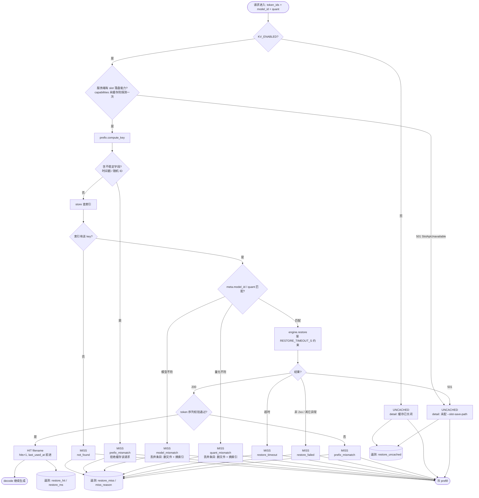

# Phase 1 设计 · KV 缓存策略层

| 项 | 值 |
| :--- | :--- |
| 状态 | **进行中**（T-05 已落地骨架；T-06~T-13 分票填充） |
| 需求真相源 | [`../SPEC.md`](../SPEC.md) —— 本文档与 SPEC 冲突时以 SPEC 为准 |
| 执行单元 | [`../tickets/`](../tickets/README.md) |
| 隔离边界 | 全部代码在 `kv-cache-resume/` 内，**不 import 也不修改 LexAgent `src/`** |

> 本文档由各票**追加章节**，T-13 合并定稿。凡标注「T-xx 补章」的章节，在该票完成前内容为占位。

---

## 1. 模块职责边界（T-05）

一句话原则：**决策与 IO 分离**。策略层只做选择，HTTP 与磁盘各有专人。

| 模块 | 职责 | **不做** | 落地票 |
| :--- | :--- | :--- | :--- |
| `policy.py`<br>`KVCachePolicy` | 决策中枢：`lookup` / `persist` / `enforce_limits`；持有 per-key 锁 | 不发 HTTP、不开文件、不做重试 | T-09 / T-10 / T-11 |
| `engine.py`<br>`LlamaSlotClient` | **唯一**碰 HTTP 的地方：`health` / `capabilities` / `save` / `restore` | 不做降级决策（那是 policy 的事） | T-06 |
| `prefix.py` | 键计算 `compute_key`；归一化 `canonicalize`；不稳定字段检测 | 不实现真实 tokenizer（词表属接入侧） | T-07 |
| `store.py`<br>`CacheIndex` | 磁盘布局：`bin` / `meta` / `index.json`；原子写；单写者；孤儿回收 | 不做 LRU 决策（那是 eviction 的事） | T-08 |
| `eviction.py` | LRU 淘汰 + 磁盘水位状态机 | 不决定「何时该淘汰」（由 policy 在 persist 前触发） | T-11 |
| `telemetry.py` | 事件定义与 JSONL 输出 | 不做聚合 / 可视化（那是 LexAgent F15 的事） | T-12 |
| `config.py` | `KV_*` 环境变量与校验 | 不做进程级缓存（改了 env 就立即生效） | T-05 ✅ |
| `errors.py` | 错误分类，**降级逻辑的分支依据** | 不做字符串匹配 | T-05 ✅ |
| `models.py` | 跨模块数据结构：`Decision` / `CacheMeta` / `TelemetryEvent` | 不含任何行为逻辑 | T-05 ✅ |

### 1.1 数据流（对齐 SPEC §4.2）

```
请求(token 序列)
      │
      ▼
┌──────────────────────────────┐
│ policy.lookup()    [决策]     │
│  1. prefix.compute_key()     │
│  2. store 查索引 → 命中?       │
└───┬──────────────────────┬───┘
    │ HIT                  │ MISS / UNCACHED
    ▼                      ▼
┌────────────────┐  ┌─────────────────┐
│ engine.restore │  │ 冷 prefill      │
│ （装 KV 到 slot）│  │ （正常推理）      │
└───────┬────────┘  └────────┬────────┘
        └─────────┬──────────┘
                  ▼
         ┌─────────────────┐
         │  decode 继续生成  │
         └────────┬────────┘
                  ▼
         ┌──────────────────────────────────┐
         │ policy.persist()                  │
         │  eviction.enforce_limits() 前置检查 │
         │  engine.save → store 写 meta+index │
         └────────┬─────────────────────────┘
                  ▼
         ┌─────────────────┐
         │ telemetry 一行   │
         └─────────────────┘
```

---

## 2. 命中判断状态机（T-05 核心交付）

本图是 T-09（命中判定）与 T-10（落盘）的施工图。**每个出口都必须有测试覆盖，不留「等等」式未定义节点**（T-09 验收清单最后一条）。



### 2.1 出口分支清点（T-09 逐条对表）

| # | 出口 | `DecisionKind` | reason | 依据 |
| ---: | :--- | :--- | :--- | :--- |
| 1 | 缓存已关闭 | `UNCACHED` | — | `KV_ENABLED=false` |
| 2 | 服务端无能力（501） | `UNCACHED` | — | REQ-E3 |
| 3 | 不稳定字段 → 拒绝缓存 | `MISS` | `prefix_mismatch` | REQ-W2、T-07 |
| 4 | 索引无此 key | `MISS` | `not_found` | REQ-E2 |
| 5 | 模型不符 → 丢弃条目 | `MISS` | `model_mismatch` | REQ-U2 |
| 6 | 量化不符 → 丢弃条目 | `MISS` | `quant_mismatch` | REQ-U2 |
| 7 | restore 超时 | `MISS` | `restore_timeout` | REQ-W1、AC5 |
| 8 | restore 非 2xx / 异常 | `MISS` | `restore_failed` | REQ-W1、AC5 |
| 9 | token 序列校验失败 | `MISS` | `prefix_mismatch` | REQ-W2 |
| 10 | **HIT** | `HIT` | — | REQ-E2、REQ-E4 |

> **共同纪律**：3~9 号出口**一律不抛异常**，全部回退冷 prefill 把请求做完（REQ-W1）。
> 「失败不抛」不等于「失败静默」—— 每个 MISS 都带 reason 且进告警日志。

---

## 3. 配置清单（T-05）

`KV_*` 全部集中在 `config.py`，每个都有默认值；**非法值抛 `KVCacheConfigError`，不静默取默认**。

| 环境变量 | 默认值 | 语义 | 依据 |
| :--- | :--- | :--- | :--- |
| `KV_ENABLED` | `true` | 缓存总开关 | T-05 |
| `KV_CACHE_DIR` | `kv` | 缓存目录（相对路径以 `kv-cache-resume/` 为基准） | SPEC §4.4 |
| `KV_MAX_BYTES` | `2GiB` | 目录占用上限（**保守占位，待 T-04 校准**） | REQ-S1、AC6 |
| `KV_MAX_ENTRIES` | `64` | 条目数上限（**保守占位，待 T-04 校准**） | REQ-S2 |
| `KV_MIN_FREE_BYTES` | `1GiB` | 磁盘水位下限；`0` = 关闭水位保护 | REQ-W4 |
| `KV_QUANT` | `f16` | KV 精度：`f16` / `q8` / `q4`，记入元数据 | REQ-O3 |
| `VERIFY_EXACT` | `false` | 逐字比对验收模式（默认关闭，开着显著变慢） | REQ-O1 |
| `RESTORE_TIMEOUT_S` | `10` | restore 超时上限 | REQ-W1 |
| `SERVER_BASE_URL` | `http://127.0.0.1:8080` | `llama-server` 地址 | T-06 |
| `KV_CAPABILITY_TTL_S` | `300` | 能力探测结论的缓存窗口；`0` = 每次都重探 | T-06 追加 |

> `KV_CAPABILITY_TTL_S` 是 T-06 需要而 T-05 清单未列的追加项（能力探测不能每次请求都发一次 RTT）。
> R6 的「上游 API 未承诺稳定」靠这个窗口兜：探测结论有失效期，引擎升级后不会永久错下去。

---

## 4. 归一化清单（T-07 补章 · 待填）

> 由 [T-07](../tickets/T-07-prefix-key.md) 补齐：**哪些字段被归一化、哪些被拒绝**的显式清单。
> T-13 验收时按本清单逐条构造样本（AC7）。

---

## 5. 淘汰顺序与水位状态机（T-11 补章 · 待填）

> 由 [T-11](../tickets/T-11-eviction-and-watermark.md) 补齐：LRU 淘汰流程图 + 水位状态转换图。

---

## 6. F15 字段映射表（T-12 补章 · 待填）

> 由 [T-12](../tickets/T-12-telemetry.md) 补齐：本项目字段 ↔ LexAgent F15 字段 ↔ 单位 ↔ 语义差异。
> **同名不同物必须显式标注**：F15 的 cache 指云端前缀缓存，本项目是本地 KV 文件缓存。

---

## 7. 变更记录

| 日期 | 变更 | 票 |
| :--- | :--- | :--- |
| 2026-09-12 | 初版：模块边界表 + 数据流图 + 命中判断状态机（10 个出口）+ 配置清单 | T-05 |
