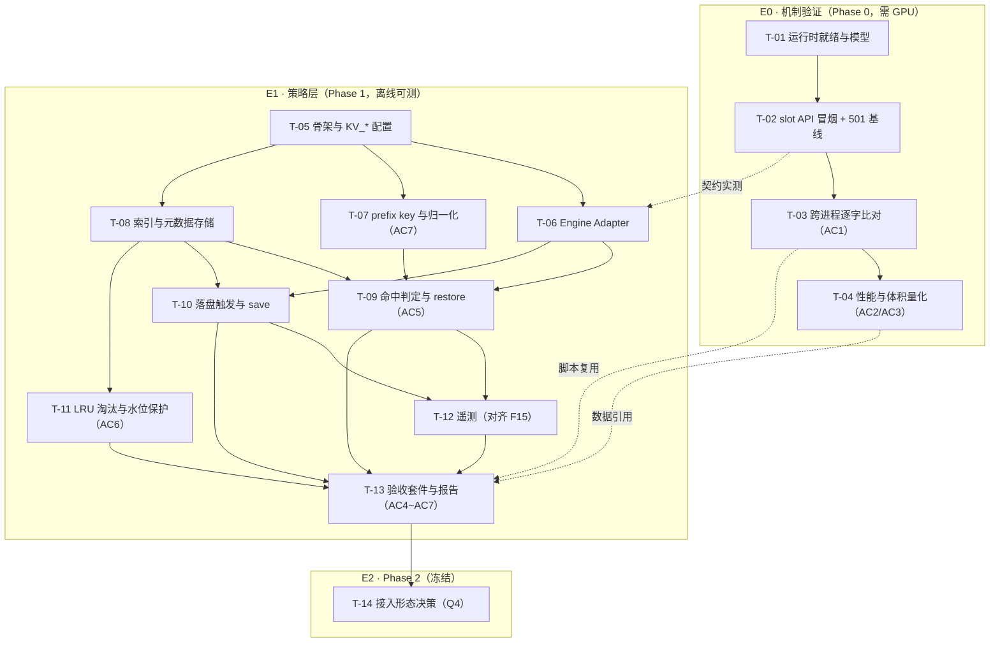

# kv-cache-resume · Tickets

> 由 [`SPEC.md`](../SPEC.md) v0.1 拆分（2026-09-11）。
> **SPEC 是需求的单一真相源，本目录是执行单元**——票里不重述背景，只写「要做出什么」。

## 怎么读

每张票是一个**垂直切片**：不是「写一个模块」，而是「让某件事端到端可验证」。每张票都能在一轮上下文里做完，做完就能勾验收清单。

- `阻塞于` 只列**真正卡住它**的票；「相关但能并行」的不列。
- **只做前沿票**（阻塞项全部完成的票）。做完一张，勾验收清单，回来更新下面的状态表。
- 票里出现分歧时以 `SPEC.md` 为准；SPEC 与实测冲突时以**实测**为准，并回头改 SPEC。

## 分组

| Epic | 票 | 定位 | 环境依赖 |
| :--- | :--- | :--- | :--- |
| **E0 · 机制验证**（SPEC Phase 0） | T-01 ~ T-04 | 证明「跨进程 KV 恢复 + 逐字续生成」在 llama.cpp 上成立，并量出三个数 | 需 GPU + 真实 `llama-server` |
| **E1 · 策略层**（SPEC Phase 1） | T-05 ~ T-13 | 本项目**实质交付物**：何时 save / 用什么 key / 何时 restore / 何时淘汰 | **全程离线可测**（mock engine，不依赖 GPU） |
| **E2 · 接回 LexAgent**（SPEC Phase 2） | T-14（冻结） | 只出架构决策，不写接入代码 | 需 SPEC §11 Q4 定案 |

> **E0 与 E1 互不阻塞。** E1 全程走 mock，可以在没有 GPU 时先做完全部九张票；E0 的实测只影响 T-06 的契约细节与 T-04 的数字。两类工作可以真正并行。

## 隔离边界（每张票都适用）

- 所有产出写在 `kv-cache-resume/` 内，**不改动 `src/` 任何文件**（SPEC §1 定位）
- 本目录有独立 `pyproject.toml` 与 `tests/`，**不动仓库根 `pyproject.toml`**
- 缓存本体（`kv/`、`*.bin`、`models/`、`*.gguf`、`logs/`）已被 `.gitignore` 挡住，**绝不入库**
- 提交前跑 ruff check + format（与 LexAgent 同款门禁）

## 依赖图

## 状态表

图例：⬜ 未开始 · 🔄 进行中 · ✅ 完成 · ⛔ 冻结

| 票 | 标题 | Epic | 阻塞于 | 阻塞 | SPEC 依据 | 状态 |
| :--- | :--- | :--- | :--- | :--- | :--- | :--- |
| [T-01](./T-01-runtime-and-model.md) | llama.cpp 运行时就绪与模型取用 | E0 | — | T-02 | §11 Q1/Q2/Q3、§9.1 | ✅ |
| [T-02](./T-02-slot-api-smoke.md) | slot API 冒烟 + 501 基线 | E0 | T-01 | T-03、T-06\* | §3.1、REQ-E3、REQ-O3、R5/R6 | ✅ |
| [T-03](./T-03-cross-process-exact-match.md) | 跨进程续生成 + 逐字比对 | E0 | T-02 | T-04、T-13\* | G1、REQ-O1、AC1 | ⬜ |
| [T-04](./T-04-perf-and-size.md) | restore 提速与 KV 体积量化 | E0 | T-03 | T-13\* | G2、AC2、AC3、§9.2 | ⬜ |
| [T-05](./T-05-skeleton-and-config.md) | 策略层骨架与 KV_* 配置 | E1 | — | T-06~T-13 | G3 | ✅ |
| [T-06](./T-06-engine-adapter.md) | Engine Adapter（/slots 客户端） | E1 | T-05 | T-09、T-10 | REQ-E3、R6 | ⬜ |
| [T-07](./T-07-prefix-key.md) | prefix key 计算与归一化 | E1 | T-05 | T-09 | REQ-U1/U2/W2、AC7、R1 | ⬜ |
| [T-08](./T-08-index-store.md) | 索引与元数据存储（单写者） | E1 | T-05 | T-09、T-10、T-11 | REQ-U3、§4.3、§4.4 | ⬜ |
| [T-09](./T-09-hit-and-restore.md) | 命中判定与 restore 全流程 | E1 | T-06、T-07、T-08 | T-12、T-13 | REQ-E2/E4/W1/W2、AC5 | ⬜ |
| [T-10](./T-10-persist-and-save.md) | 落盘触发与 save 语义 | E1 | T-06、T-08 | T-12、T-13 | REQ-E1、REQ-W3 | ⬜ |
| [T-11](./T-11-eviction-and-watermark.md) | LRU 淘汰与磁盘水位保护 | E1 | T-08 | T-13 | REQ-S1/S2/W4、AC6、R2 | ⬜ |
| [T-12](./T-12-telemetry.md) | 遥测口径（对齐 F15） | E1 | T-09、T-10 | T-13 | G4、REQ-O2 | ⬜ |
| [T-13](./T-13-acceptance-suite.md) | 验收套件与报告 | E1 | T-09~T-12 | T-14 | AC4~AC7、REQ-O1 | ⬜ |
| [T-14](./T-14-phase2-decision-frozen.md) | Phase 2 接入形态决策 | E2 | T-13 | Phase 2/3 | §7 Phase 2、R4、Q4 | ⛔ |

\* 软依赖：只引用产物（契约 / 脚本 / 数据），不卡开工。

## REQ 追溯矩阵

18 条需求逐条落到票上。**T-13 会用这张表反查覆盖度，缺一条即视为未完成。**

| REQ | 摘要 | 落地票 |
| :--- | :--- | :--- |
| U1 | `hash(模型+量化+完整 token 序列)` 作唯一键 | T-07 |
| U2 | restore 前校验模型/量化，不匹配即丢弃 | T-07（键侧）、T-09（restore 侧） |
| U3 | 同 key 单写者语义 | T-08 |
| E1 | 生成正常结束/max_tokens → 落盘 + 写元数据 | T-10 |
| E2 | 同键请求优先 restore 而非重新 prefill | T-09 |
| E3 | save/restore 返回 501 → 明确报错 + 降级无缓存模式 | T-06（报错）、T-09（降级） |
| E4 | 命中后更新 `last_used_at` 与 `hits` | T-09 |
| S1 | 目录超 `KV_MAX_BYTES` → LRU 淘汰 | T-11 |
| S2 | 条目超 `KV_MAX_ENTRIES` → LRU 淘汰 | T-11 |
| W1 | restore 失败/超时/非 2xx → 回退冷 prefill，不中断请求 | T-09 |
| W2 | 前缀序列校验不一致 → 放弃该缓存 | T-07（键侧）、T-09（校验侧） |
| W3 | 落盘失败 → 仅告警，不阻断生成 | T-10 |
| W4 | 磁盘低于 `KV_MIN_FREE_BYTES` → 停写 + 告警 + 空间恢复后自动续写 | T-11 |
| O1 | `VERIFY_EXACT=true` → 逐字比对并输出结论 | T-03（机制）、T-13（产品化） |
| O2 | 遥测 `restore_hit` / `restore_miss` / `saved_bytes` / `restore_ms` / `cold_prefill_ms` | T-12 |
| O3 | `KV_QUANT` 下调 KV 精度并记入元数据 | T-02（服务端参数）、T-08（元数据） |

## AC 追溯矩阵

| AC | 判据 | 目标值 | 主责票 | 汇总 |
| :--- | :--- | :--- | :--- | :--- |
| AC1 | 跨进程续生成逐字一致（temp=0） | 100% | T-03 | T-13 |
| AC2 | restore vs 冷 prefill（4K 量级） | ≥5× 提速 | T-04 | T-13 |
| AC3 | KV 大小对 token 数线性可预测 | R²>0.95、误差<20% | T-04 | T-13 |
| AC4 | 同前缀重发命中率 | ≥99%（100 次） | T-13 | T-13 |
| AC5 | restore 被强制失败时请求仍完成 | 100% 成功 | T-09 | T-13 |
| AC6 | 目录占用 ≤ `KV_MAX_BYTES` | 始终成立 | T-11 | T-13 |
| AC7 | 前缀扰动（schema key 序 / 空白 / 时间戳）正确判 miss | 3/3 | T-07 | T-13 |

## 推荐执行顺序

| 批次 | 内容 | 说明 |
| :--- | :--- | :--- |
| 第 1 批 | T-01 → T-02 | 拿到 slot API 的**实测契约**（端点、slot id 语义、错误码） |
| 第 2 批 | T-05 ∥ T-03 | T-05 起 E1 骨架；T-03 做 E0 验证链。两者互不依赖 |
| 第 3 批 | T-06 ∥ T-07 ∥ T-08 ∥ T-04 | 三张 E1 基础票互不阻塞，可并行；T-04 收 E0 尾 |
| 第 4 批 | T-09 → T-10 ∥ T-11 → T-12 → T-13 | T-09 是关键路径；T-11 可与 T-10 并行 |
| 第 5 批 | T-14 | 评审 Q4，**只出决策不写代码** |

> 若没有 GPU：跳过第 1、3 批里的 T-04，直接跑 T-05 → T-13，E1 全程 mock 可交付；AC1~AC3 留空并在 T-13 报告里标注「未验证」。

## 未立项：Phase 3（与 ReAct 结合）

SPEC §7 Phase 3 是真正的收益点（让 ReAct 循环 18~20 次调用之间复用 system + 工具 schema 前缀），但**必须等 T-14 决策完成后才有载体**，故暂不拆票。届时新开一个 Epic，单独的票挂在 `tickets/` 下。

## 变更记录

| 日期 | 变更 |
| :--- | :--- |
| 2026-09-11 | 由 SPEC v0.1 首次拆分：14 张票（13 活跃 + 1 冻结） |
| 2026-09-12 | T-01 ✅（运行时就绪与模型取用）；T-05 ✅（策略层骨架与 `KV_*` 配置） |
| 2026-09-12 | **T-02 ✅**（slot API 冒烟 + 501 基线）—— 第 1 批完成，slot API 实测契约共 9 条（见 `docs/phase0-slot-api-findings.md`），下游 T-03 可开工、T-06 接口形态已定（单步 POST） |
